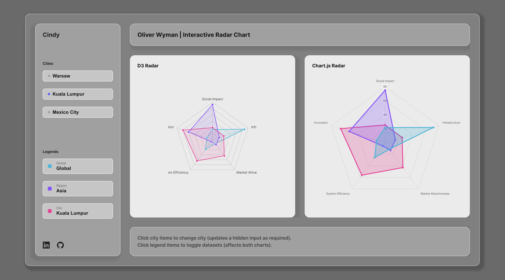
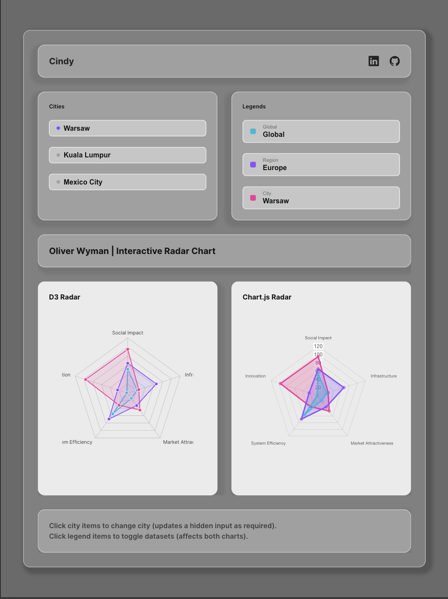
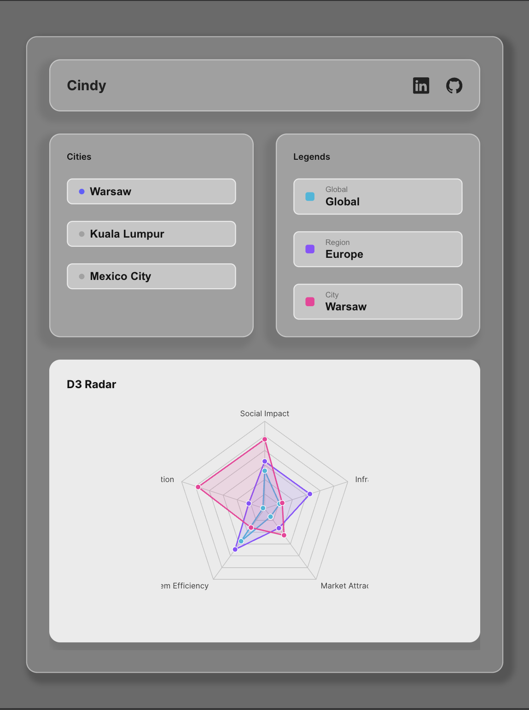
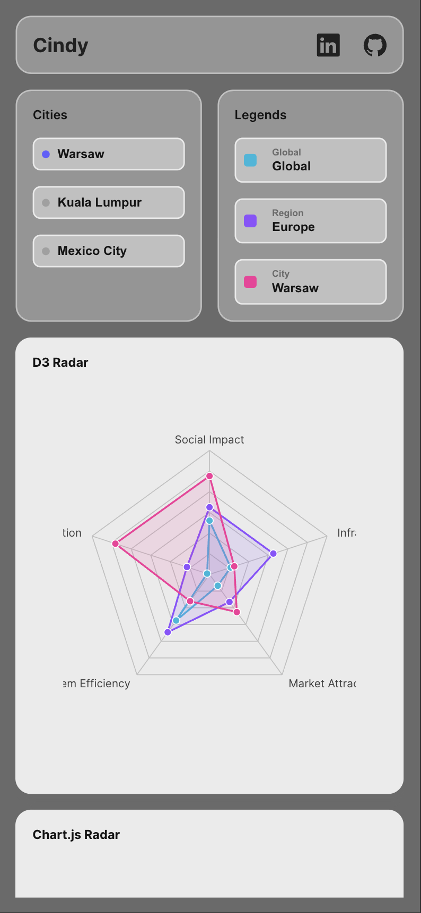

# Oliver Wyman — Radar Chart

This repository contains a minimal Vite project that implements an interactive radar chart.
<br>☑ Tech stack: D3 | Chart.js | JS | CSS | HTML
<br>☑ Hidden input tag to store the city_name value.
<br>☑ Radar chart data is based on the city_name value from the hidden input tag.
<br>☑ Global, region, city legends present on the radar chart.
<br>☑ Radar chart labels are pulled dynamically from the dataset.

---

## Project Structure

```
question-2/
├─ index.html
├─ package.json
├─ vite.config.js
├─ README.md
├─ .gitignore
├─ public/
│  ├─ 430x932.png
│  ├─ 768x1024.png
│  ├─ 1024x1366.png
│  ├─ demo-video.mov
│  └─ desktop-screen.png
└─ src/
   ├─ data/
   │  └─ dataset.json
   ├─ styles/
   │  └─ styles.css
   ├─ chartjs.js
   ├─ d3radar.js
   ├─ data.js
   ├─ dom.js
   ├─ main.js
   ├─ state.js
   └─ ui.js
```

---

## Quick Start

**Requirements**

-   Node.js 18+ (recommended) or any Node.js LTS
-   npm

```bash
npm install
npm run dev
```

## Demo

### Video

[](./public/demo-video.mov)

### Desktop Screen


### iPad Pro Screen

1024 x 1366



### iPad Mini Screen

768 x 1024



### iPhone 14 Pro Max Screen

430 x 932


